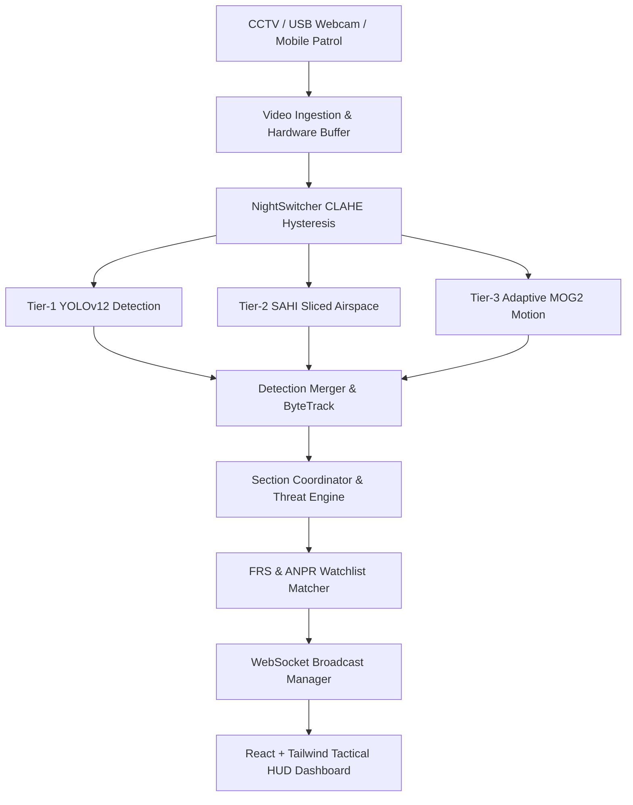

# IBVAP — Intelligent Border Video Analytics Platform

[](https://github.com/Alister007-arch/IBVAP-Border-Surveillance)
[](LICENSE)
[](https://www.python.org/downloads/)
[](frontend/)
[](https://ultralytics.com)

> **Autonomous Multi-Tier Edge Surveillance & Threat Interception Platform**  
> Designed for Border Security, Critical Perimeter Defense, and Real-Time Multi-Sensor Tactical Coordination.

---

## 🌟 Overview

**IBVAP (Intelligent Border Video Analytics Platform)** transforms off-the-shelf surveillance infrastructure (USB Webcams, IP RTSP streams, and field mobile smartphones) into a tactical edge surveillance network.

It integrates a 3-tier cascade detection pipeline, face recognition & automated license plate recognition (ANPR) watchlist synchronization, low-latency WebSocket streaming, and a mission-critical tactical HUD command dashboard.

---

## 🚀 Key Capabilities

### 1. 3-Tier Multi-Cascade AI Engine
- **Tier-1 YOLOv12 Deep Inference**: Attention-centric high-precision detection of humans, vehicles, knives, and weapons with ByteTrack persistence and optimized high-FPS throughput.
- **Tier-2 Native SAHI Sliced Airspace Inference**: Native 320x320 sliced inference over upper airspace coordinates to detect small, distant aerial threats (Drones, UAVs, Quadcopters) at 50–150m without shrinking down pixels.
- **Tier-3 Adaptive MOG2 Motion Fallback**: Dynamic learning rate adaptation and shadow elimination to detect crawling infiltrators and camouflaged moving targets when thermal or optical contrast is low.

### 2. Live FRS & ANPR Watchlist Synchronization
- **Face Recognition**: 128-d / 512-d cosine similarity matching against registered targets with configurable matching thresholds.
- **Target Tracking Isolation**: Strict bounding box tracking ID isolation prevents false-positive watchlist alarms when multiple civilians/bystanders are in frame.
- **ANPR License Plate Matching**: Automated OCR detection against flagged vehicle databases.

### 3. Anti-Flicker Hardware Video Stabilization
- **Hardware Thread-Safe Capture**: DirectShow backend with hardware `MJPG` codec and `CAP_PROP_BUFFERSIZE = 1` prevents video lag.
- **Thread Memory Buffer Clones**: Deep array copies eliminate OpenCV driver buffer tearing.
- **Day/Night CLAHE Hysteresis**: 16-lux hysteresis margin (`60 ± 8.0` lux) prevents brightness flapping under variable ambient indoor or dawn/dusk lighting.
- **Synchronous Browser Decoding**: `` eliminates 1-frame black blinking in Chromium.

### 4. Multi-Camera & Mobile Field Ingestion
- **Dual-Port Architecture**: Port `8000` (HTTP Tactical Dashboard) + Port `8443` (Secure HTTPS Mobile Patrol Streamer).
- **Mobile Field Patrol**: Mobile phones can stream live camera video directly over browser HTTPS (`/phone_stream.html?id=phone_1`) with zero app installation.
- **IP CCTV RTSP Support**: Dynamic addition of RTSP / HTTP surveillance cameras from the dashboard.

---

## 🏗️ Architecture Overview



---

## 💻 Quick Start

### Prerequisites
- Python 3.10+
- Node.js 18+ (for frontend)
- Webcam, IP camera, or test video file

### 1. Clone the Repository
```bash
git clone https://github.com/Alister007-arch/IBVAP-Border-Surveillance.git
cd IBVAP-Border-Surveillance
```

### 2. Backend Setup
```bash
# Install Python dependencies
pip install -r requirements.txt

# Start the Dual-Port Surveillance Server
python backend/run_server.py
```
- **HTTP Tactical Dashboard**: `http://localhost:8000`
- **HTTPS Mobile Patrol Stream**: `https://<YOUR_LAN_IP>:8443/phone_stream.html`

### 3. Frontend Setup (Development)
```bash
cd frontend
npm install
npm run dev
```

---

## 📡 API & WebSocket Specification

| Endpoint | Protocol | Description |
| :--- | :--- | :--- |
| `http://localhost:8000` | HTTP | Tactical Mission Command Web Dashboard |
| `https://localhost:8443/phone_stream.html` | HTTPS | Mobile Field Patrol Camera Streamer |
| `ws://localhost:8000/ws/frames/{camera_id}` | WebSocket | Real-time 15 FPS JPEG Base64 Frame Feed |
| `ws://localhost:8000/ws/alerts` | WebSocket | Priority Tactical Alert Dispatch Channel |
| `GET /api/cameras` | HTTP REST | List active cameras & patrol nodes |
| `POST /api/cameras` | HTTP REST | Dynamically add IP RTSP / USB camera feed |
| `GET /api/watchlist` | HTTP REST | Query active terrorist / suspect watchlist |
| `POST /api/watchlist` | HTTP REST | Register new subject with face photo |

---

## 👤 Author & Maintainer

- **Developer**: **Alister007-arch** (Divyanshu Kashyap)
- **GitHub**: [@Alister007-arch](https://github.com/Alister007-arch)
- **Repository**: [https://github.com/Alister007-arch/IBVAP-Border-Surveillance](https://github.com/Alister007-arch/IBVAP-Border-Surveillance)

---

## 📄 License
This project is licensed under the MIT License — see the [LICENSE](LICENSE) file for details.
